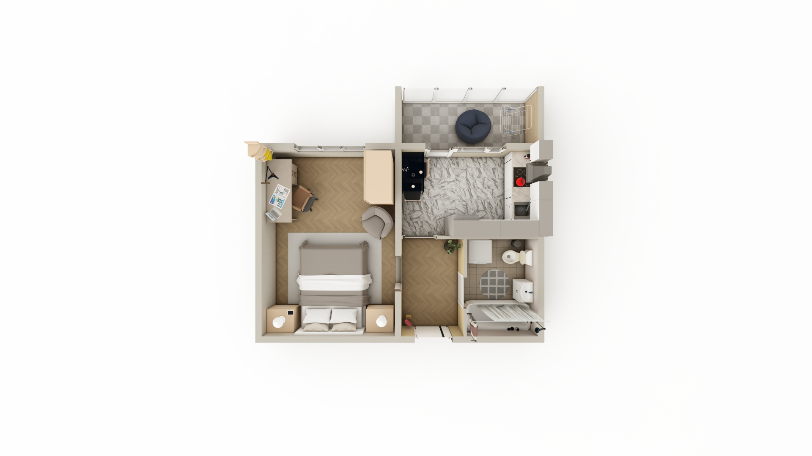

# Как встроить на сайт
1. Копируете папку `assets` и вставляете в свой проект
2. Вставляете следующий код в тэг `<head>`:
   ```
    <link rel="stylesheet" type="text/css" 
    href="assets/libs/slick/slick.css" />
    <link rel="stylesheet" type="text/css" 
    href="assets/libs/slick/slick-theme.css" />
    <link rel="stylesheet" href="assets/css/style.css" />

    <link rel="stylesheet" href="https://fonts.googleapis.com/css2?
		family=Material+Symbols+Outlined:opsz,wght,FILL,GRAD@24,400,0,0" />

    <script type="text/javascript" 
    src="assets/libs/jquery-1.11.0.min.js"></script>
    <script type="text/javascript" 
    src="assets/libs/jquery.interactive_3d.js"></script>
   ```
3. В тэг `<body>` вставляете это:
   ```
    <div class="slider">
    
    
    <div id="3d" class="demo-3d slider__item">
        
    </div>

    <div class="slider__item">
        <div class="overflow" id="tour-modal">
            <div class="container container--modal">
                <div class="overflow__inner">
                    <p class="title">Панорамный тур</p>
                    <p class="description">
                        <span class="material-symbols-outlined icon">360</span>
                        <span>Смотрите по сторонам</span>
                    </p>
                    <p class="description">
                        <span class="material-symbols-outlined icon">
                        	ads_click
                        </span>
                        <span>Нажимайте для перемещения</span>
                    </p>
                    <button class="button" id="tour-button">Начать</button>
                </div>
            </div>
        </div>
        <iframe id="tour" src="" frameborder="0" 
        allowfullscreen data-src="assets/libs/360Tour/index.htm" 
        class="slider__item"></iframe>
    </div>
    </div>
    <script type="text/javascript" src="assets/libs/slick/slick.min.js"></script>
    <script src="assets/js/main.js"></script>
   ```
4. Если папка `assets` находится не в корневом каталоге, то дописываем путь до неё, что бы было `ваш_путь/assets/дальше_не_трогаем`